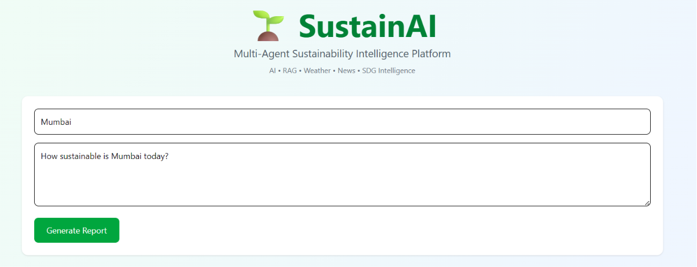
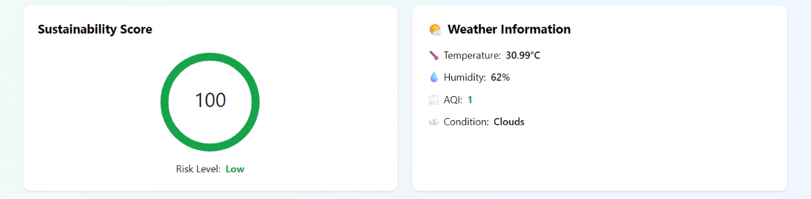
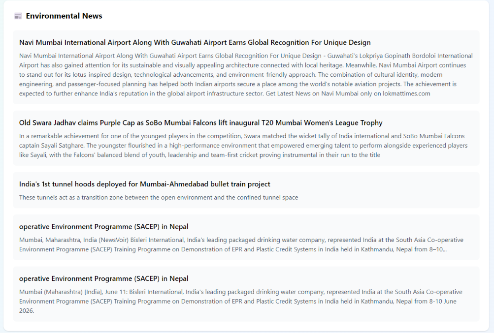
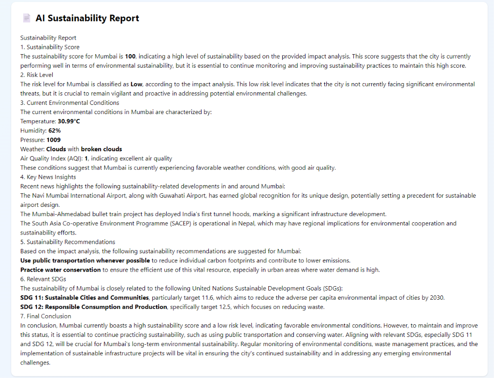
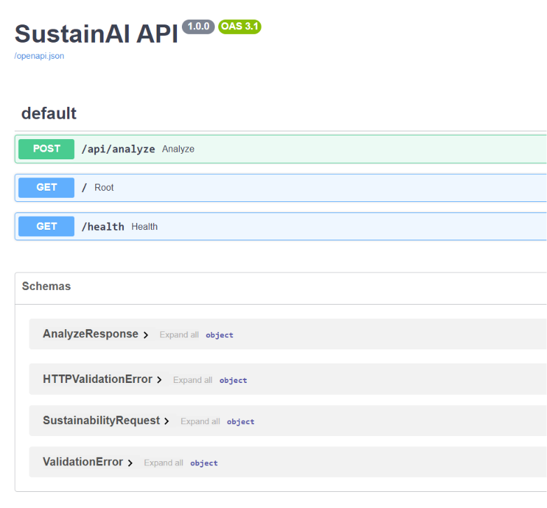

# 🌱 SustainAI - Multi-Agent Sustainability Intelligence Platform

## Overview

SustainAI is an AI-powered sustainability intelligence platform that combines Retrieval-Augmented Generation (RAG), real-time environmental data, weather intelligence, news monitoring, and AI-driven sustainability assessment to generate comprehensive sustainability reports aligned with the United Nations Sustainable Development Goals (SDGs).

The platform leverages multiple specialized AI agents that work together to analyze environmental conditions, sustainability trends, and policy insights to provide actionable recommendations for cities and communities.

---

## Features

### 🤖 Multi-Agent Architecture

* Weather Intelligence Agent
* Environmental News Agent
* Sustainability Impact Agent
* RAG Knowledge Agent
* Report Generation Agent
* Orchestrator Agent

### 🌍 Sustainability Analysis

* Real-time weather monitoring
* Air Quality Index (AQI) assessment
* Environmental news aggregation
* Sustainability scoring
* Risk-level prediction
* SDG mapping and recommendations

### 📚 RAG-Powered Knowledge Base

* ChromaDB Vector Database
* HuggingFace Embeddings
* Semantic Search
* Sustainability Knowledge Retrieval
* SDG-focused document analysis

### 📊 Interactive Dashboard

* Sustainability Score Visualization
* Environmental Conditions Monitoring
* News Insights Dashboard
* AI-generated Sustainability Reports
* Responsive User Interface

---

## System Architecture

```text
                        ┌─────────────────┐
                        │ React Frontend  │
                        └────────┬────────┘
                                 │
                                 ▼
                        ┌─────────────────┐
                        │ FastAPI Backend │
                        └────────┬────────┘
                                 │
          ┌──────────────────────┼──────────────────────┐
          ▼                      ▼                      ▼

 ┌───────────────┐      ┌───────────────┐      ┌───────────────┐
 │ Weather Agent │      │ News Agent    │      │ Impact Agent  │
 └───────┬───────┘      └───────┬───────┘      └───────┬───────┘
         │                      │                      │
         ▼                      ▼                      ▼

 OpenWeather API         GNews API          Sustainability Scoring

                                 │
                                 ▼

                      ┌────────────────────┐
                      │ RAG Knowledge Agent│
                      └─────────┬──────────┘
                                │
                                ▼

                    ChromaDB + HuggingFace
                          Embeddings

                                │
                                ▼

                      ┌──────────────────┐
                      │ Groq LLM Engine  │
                      └─────────┬────────┘
                                │
                                ▼

                   AI Sustainability Report
```

---

## Tech Stack

### Frontend

* React.js
* Vite
* Tailwind CSS
* Axios
* React Markdown
* React Circular Progressbar
* React Spinners

### Backend

* FastAPI
* Python
* Uvicorn

### AI & Machine Learning

* Groq LLM
* HuggingFace Embeddings
* LangChain
* Retrieval-Augmented Generation (RAG)

### Vector Database

* ChromaDB

### APIs

* OpenWeather API
* GNews API
* Groq API

### Knowledge Sources

* Sustainable Development Goals (SDGs)
* Environmental Guidelines
* Sustainability Policies

---

## Project Structure

```text
SustainAI
│
├── agents/
│   ├── weather_agent.py
│   ├── news_agent.py
│   ├── impact_agent.py
│   ├── rag_agent.py
│   └── orchestrator.py
│
├── routers/
│   └── sustainability.py
│
├── schemas/
│   └── response_model.py
│
├── utils/
│   ├── weather_api.py
│   ├── news_api.py
│   ├── llm.py
│   └── loader.py
│
├── data/
│   ├── sdg_documents/
│   ├── water_guidelines/
│   ├── energy_guidelines/
│   └── waste_policies/
│
├── chroma_db/
│
├── sustainai-frontend/
│   ├── src/
│   ├── components/
│   ├── services/
│   └── public/
│
├── main.py
├── ingest.py
└── requirements.txt
```

---

## Sustainability Scoring Model

The platform evaluates sustainability using:

### Air Quality Assessment

* AQI Level Analysis
* Environmental Risk Identification

### Climate Assessment

* Temperature Monitoring
* Humidity Analysis
* Weather Impact Assessment

### News Intelligence

* Pollution Monitoring
* Sustainability Initiatives
* Environmental Policy Tracking

### Risk Categories

| Score    | Risk Level |
| -------- | ---------- |
| 80 - 100 | Low        |
| 60 - 79  | Moderate   |
| 40 - 59  | High       |
| 0 - 39   | Critical   |

---

## Sample Output

### Sustainability Score

```text
Score: 70
Risk Level: Moderate
```

### Weather Analysis

```text
Temperature: 39.95°C
Humidity: 21%
AQI: 3
Condition: Clear Sky
```

### Recommendations

```text
• Reduce outdoor activities during peak pollution hours.
• Conserve electricity and avoid peak heat exposure.
• Use public transportation whenever possible.
• Practice water conservation.
```

---

## Installation

### Clone Repository

```bash
git clone https://github.com/CodeByVishal-0/SustainAI.git
cd SustainAI
```

### Create Virtual Environment

```bash
python -m venv venv
```

### Activate Environment

```bash
venv\Scripts\activate
```

### Install Dependencies

```bash
pip install -r requirements.txt
```

### Run Backend

```bash
uvicorn main:app --reload
```

Backend:

```text
http://127.0.0.1:8000
```

Swagger Docs:

```text
http://127.0.0.1:8000/docs
```

### Run Frontend

```bash
cd sustainai-frontend
npm install
npm run dev
```

Frontend:

```text
http://localhost:5173
```

---

## Screenshots

### Dashboard



### Sustainability Score and Weather Information



### Environmental News




### Sustainability Report


### Swagger Documentation



---

## Future Improvements

* Deployment Optimization
* Advanced Sustainability Metrics
* Historical Trend Analysis
* Interactive Data Visualizations
* User Authentication
* City Comparison Dashboard
* ESG Reporting Module
* Carbon Footprint Estimation

---

## Learning Outcomes

Through this project:

* Implemented Multi-Agent AI Architecture
* Built Retrieval-Augmented Generation Pipeline
* Integrated ChromaDB Vector Search
* Developed FastAPI Backend APIs
* Created React Dashboard UI
* Used HuggingFace Embeddings
* Integrated Real-time Environmental Data APIs
* Generated AI-powered Sustainability Reports

---

## Author

**Vishal Prajapati**

B.Tech CSE (AI & ML)

GitHub:
https://github.com/CodeByVishal-0

---

## License

This project is developed for educational and portfolio purposes.
